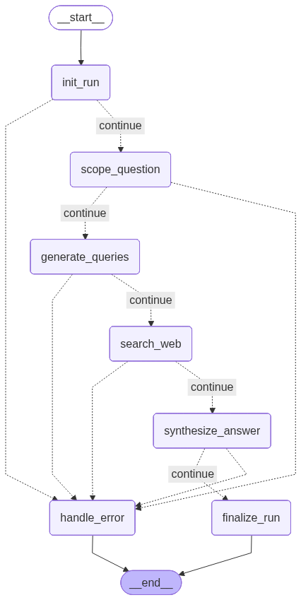

---
title: Focused Research Agent
emoji: 🔍
colorFrom: blue
colorTo: green
sdk: docker
app_port: 7860
pinned: false
---
# 🔍 Focused Research Agent

> 一个由 AI 驱动的研究助手，它可以规划、搜索并综合信息 —— 为你提供有来源的答案，而不是幻觉式的内容。

---

## 🎯 项目功能

大多数 LLM 应用只是在封装一个 prompt，而这个项目构建了一个完整的研究流水线。

对于任意问题，代理会执行：

```
Your Question
    ↓
Scope Clarification     — 模型结合上下文理解你的问题
    ↓
Query Planning          — 模型生成3-6条定向搜索查询
    ↓
Web Search              — Tavily可实时获取资讯来源及相关图片
    ↓
Source Ranking          — 域名信任启发式算法对结果进行排序
    ↓
Answer Synthesis        — 模型整合出带有引用来源的答案
    ↓
Structured Result       — 答案+引用内容+资料来源+配图
```

提供三种模式：

| 模式                          | 功能                                     |
| ----------------------------- | ---------------------------------------- |
| **Quick Research**      | 约 15 秒内返回 1-3 条引用的简明答案      |
| **Conversational Chat** | 支持多轮研究，保留会话记忆               |
| **Full Report**         | 生成包含深入搜索和图片的结构化四部分报告 |

---

## 🏗️ 架构

六层结构，每层只负责一件事：

```
┌─────────────────────────────────────────────────┐
│  UI 层 (Streamlit)                               │
│  Home · Research · Chat · Report                │
│  轻客户端 — 仅通过 HTTP 调用 FastAPI            │
└─────────────────────┬───────────────────────────┘
                      │ HTTP
┌─────────────────────▼───────────────────────────┐
│  API 层 (FastAPI)                                │
│  版本化路由 · 依赖注入                           │
│  集中式异常处理                                 │
└─────────────────────┬───────────────────────────┘
                      │ 函数调用
┌─────────────────────▼───────────────────────────┐
│  应用层                                          │
│  Research · Chat · Report 用例                  │
│  输入验证 · 状态规范化                           │
└─────────────────────┬───────────────────────────┘
                      │ 图调用
┌─────────────────────▼───────────────────────────┐
│  Graph 层 (LangGraph)                            │
│  init_run → scope → queries → search            │
│  → synthesize → finalize · handle_error         │
└─────────────────────┬───────────────────────────┘
                      │
        ┌─────────────┴─────────────┐
        ▼                           ▼
  LLM 提供器                 搜索提供器
  (Groq · Ollama)              (Tavily)
        │                           │
        └─────────────┬─────────────┘
                      ▼
┌─────────────────────────────────────────────────┐
│  数据库层 (SQLite / PostgreSQL)                 │
│  Repository Pattern · 会话历史                  │
│  报告历史 · 图片持久化                          │
└─────────────────────────────────────────────────┘
```

每一层仅了解其下游直接一层内容。LangGraph 节点不知道 HTTP，FastAPI 路由不了解 LangGraph，Streamlit UI 不了解 graph 运作细节。

---

## 🧠 LangGraph 工作流

研究流水线是一个带有显式状态和条件错误路由的有向图。



### 节点

| 节点                  | 功能                                           |
| --------------------- | ---------------------------------------------- |
| `init_run`          | 生成唯一 run ID，校验问题是否存在              |
| `scope_question`    | LLM 生成问题范围、假设和约束                   |
| `generate_queries`  | LLM 生成 3-6 条针对性搜索查询                  |
| `search_web`        | Tavily 执行所有查询，去重来源，收集图片        |
| `synthesize_answer` | 按域名信任度排序来源，LLM 生成带引用的答案     |
| `finalize_run`      | 将运行标记为 `completed` 或 `error`        |
| `handle_error`      | 终止错误节点 — 记录错误并设置状态为 `error` |

### 错误路由

每个节点后都跟着一个条件边，检查 `state["errors"]`。如果存在错误 → 路由到 `handle_error`；否则继续。

节点**不会抛出异常**。它们会将错误记录到 state 中并返回。图始终可在 `__end__` 处干净终止。

---

## 🛠️ 技术栈

| 技术                   | 角色              | 说明                                     |
| ---------------------- | ----------------- | ---------------------------------------- |
| **LangGraph**    | 工作流编排        | 可确定、可复现的显式状态图               |
| **FastAPI**      | REST API 后端     | 现代 Python，内置验证和 DI               |
| **Pydantic**     | 请求/响应验证     | 在 API 与应用层之间共享验证逻辑          |
| **Groq + Llama** | LLM 提供器        | 推理速度快，免费额度充足                 |
| **Ollama**       | 替代 LLM 提供器   | 支持本地或云端，无需 API key             |
| **Tavily**       | 网络搜索          | 为 AI 代理设计，返回结构化结果和图片     |
| **SQLAlchemy**   | ORM               | 从 SQLite 切换到 PostgreSQL 只需一行配置 |
| **Streamlit**    | Web UI            | 快速构建 AI 应用界面                     |
| **httpx**        | HTTP 客户端       | 现代 Python HTTP 客户端                  |
| **uv**           | 包管理            | 快速、现代的 Python 包管理工具           |
| **pytest**       | 测试              | 175 个测试，覆盖多种策略                 |
| **Ruff**         | 代码格式化与 lint | 快速、现代的 Python 代码检查工具         |
| **SonarCloud**   | 代码质量门禁      | 持续覆盖率与质量检查                     |

---

## 📁 项目结构

```
focused-research-agent/
├── src/
│   └── focused_research_agent/
│       ├── api/                            # FastAPI 传输层
│       │   ├── routers/
│       │   │   ├── health.py               # GET /health
│       │   │   ├── research.py             # POST /api/v1/research
│       │   │   ├── chat.py                 # POST /api/v1/chat
│       │   │   ├── report.py               # POST /api/v1/report
│       │   │   ├── conversations.py        # GET /api/v1/conversations + /reports
│       │   │   └── v1.py                   # 版本化路由分组
│       │   ├── schemas/                    # Pydantic 请求/响应模型
│       │   ├── api_exception_handlers.py   # 集中处理 400/500 错误
│       │   ├── app.py                      # FastAPI 应用工厂
│       │   └── dependencies.py             # 依赖注入配置
│       ├── application/                    # 用例 / 业务逻辑层
│       │   ├── exceptions.py               # ApplicationError
│       │   ├── question_validation.py      # 共享验证逻辑 (API + 应用层)
│       │   ├── research_use_case.py        # 单轮研究
│       │   ├── chat_use_case.py            # 多轮对话研究
│       │   └── report_use_case.py          # 深度研究报告
│       ├── config/                         # 配置层
│       ├── database/                       # 数据库层
│       │   ├── models.py                   # ConversationRun SQLAlchemy model
│       │   ├── database.py                 # Engine 和 session 工厂
│       │   └── repository.py               # Repository Pattern — 唯一直接接触 SQLAlchemy 的文件
│       ├── interfaces/                     # 抽象提供器契约
│       │   ├── llm_interface.py            # LLMProvider 抽象基类
│       │   └── search_interface.py         # SearchProvider 抽象基类 + SearchResult
│       ├── nodes/                          # LangGraph 节点函数
│       │   ├── init_run.py
│       │   ├── scope_question.py
│       │   ├── generate_queries.py
│       │   ├── search_web.py
│       │   ├── synthesize_answer.py
│       │   ├── finalize_run.py
│       │   └── handle_error.py
│       ├── services/                       # 外部提供器实现
│       │   ├── llm_factory.py
│       │   ├── llm_provider_groq.py
│       │   ├── llm_provider_ollama.py
│       │   ├── search_factory.py
│       │   └── search_provider_tavily.py
│       ├── ui/                             # Streamlit UI
│       │   ├── Home.py
│       │   ├── api_client.py               # HTTP 客户端 (无 Streamlit 代码)
│       │   ├── views.py                    # 渲染函数 (无 HTTP 代码)
│       │   └── pages/
│       │       ├── 1_🔍_Research.py
│       │       ├── 2_💬_Chat.py
│       │       └── 3_📄_Report.py
│       ├── cli.py
│       ├── graph.py                        # LangGraph 图构建器
│       └── state.py                        # ResearchState TypedDict
├── tests/                                  # 175 个测试
├── docs/
├── .env.example
├── pyproject.toml
└── README.md
```

---

## ⚙️ 安装与配置

### 前提条件

- Python 3.13
- [uv](https://docs.astral.sh/uv/) 包管理器
- Tavily API key — [tavily.com](https://tavily.com)（免费）

### 1. 克隆仓库

```bash
git clone https://github.com/DSA-afk/deep-research-agent.git
cd focused-research-agent
```

### 2. 安装依赖

```bash
uv sync
```

### 3. 配置环境变量

```bash
cp .env.example .env
```

编辑 `.env`，填写你的 API Key：

```env
# LLM Configuration — Groq (recommended)
LLM_PROVIDER=groq
LLM_MODEL=llama-3.3-70b-versatile
LLM_API_KEY=your_groq_api_key_here
LLM_TEMPERATURE=0.0
LLM_MAX_RETRIES=2
LLM_MAX_TOKENS=2048

# Ollama cloud alternative (comment above, uncomment below)
# LLM_PROVIDER=ollama
# LLM_MODEL=gpt-oss:20b-cloud
# LLM_API_KEY=your_ollama_api_key_here

# Ollama Local alternative (no API key)
#LLM_PROVIDER=ollama
#LLM_MODEL=llama3.2:3b
#LLM_API_KEY=not-needed

# Search Configuration
SEARCH_PROVIDER=tavily
SEARCH_API_KEY=your_tavily_api_key_here
SEARCH_MAX_RESULTS=5
SEARCH_DEPTH=basic

# API Configuration
API_TITLE=Focused Research Agent API
API_VERSION=1.0.0
API_DEBUG=false

# UI Configuration
UI_API_BASE_URL=http://localhost:8000
UI_REQUEST_TIMEOUT=120

# Database
DATABASE_URL=sqlite:///./research_agent.db
```

---

## 🚀 运行项目

### 选项 1 — CLI

```bash
uv run focused-research-agent "What are the latest advances in quantum computing?"
```

### 选项 2 — 仅 FastAPI

```bash
uv run uvicorn --factory focused_research_agent.api.app:create_app --reload
```

API 文档地址：`http://localhost:8000/docs`

### 选项 3 — 全栈运行（推荐）

```bash
# 终端 1 — 后端
uv run uvicorn --factory focused_research_agent.api.app:create_app --reload

# 终端 2 — UI
uv run streamlit run src/focused_research_agent/ui/Home.py
```

UI 地址：`http://localhost:8501`

---

## 🧪 测试

```bash
# 运行全部 175 个测试
uv run pytest -v

# 输出覆盖率报告
uv run pytest --cov=src/focused_research_agent --cov-report=term-missing -v
```

### 测试策略

| 测试文件                        | 策略                                        |
| ------------------------------- | ------------------------------------------- |
| `test_nodes_unit.py`          | 使用 fake provider 单独隔离测试每个节点     |
| `test_nodes_smoke.py`         | 使用 fake provider 进行完整图端到端测试     |
| `test_graph_error_paths.py`   | 空问题条件路由测试                          |
| `test_providers_unit.py`      | Groq、Ollama、Tavily 的 fake SDK 客户端测试 |
| `test_api_*.py`               | FastAPI TestClient + dependency_overrides   |
| `test_database_repository.py` | 内存 SQLite                                 |
| `test_*_use_case.py`          | fake graph + 内存 SQLite                    |
| `test_ui_api_client.py`       | fake httpx 模块                             |

```

---

## 📊 API 参考

### 接口列表

```

GET  /health
POST /api/v1/research
POST /api/v1/chat
POST /api/v1/report
GET  /api/v1/conversations
GET  /api/v1/conversations/{id}
GET  /api/v1/reports

```

### 响应格式

```json
{
  "run_id": "uuid",
  "question": "string",
  "status": "completed | error",
  "scope": "string | null",
  "queries": ["string"] | null,
  "sources": [{"title": "...", "url": "...", "snippet": "...", "score": 0.95}] | null,
  "answer": "string | null",
  "citations": ["url"] | null,
  "images": ["url"] | null,
  "errors": ["string"]
}
```

### 错误格式

```json
{
  "status_code": 400,
  "error": "application_error",
  "detail": "Human readable message",
  "path": "/api/v1/research"
}
```

---

## 🎨 关键设计决策

**函数式节点，类式提供器**
节点是纯无状态转换。提供器保存客户端状态。这个区分在整个代码库中一致应用。

**基于状态的错误路由**
节点将错误记录到 `state["errors"]` — 从不抛出异常。图始终干净终止。错误路径在图中可见。

**提供器抽象**
切换 LLM 提供器只需更改一个环境变量，不需要修改应用代码。开发过程中已经验证可在 Groq 与 Ollama 之间切换。

**Repository Pattern**
只有 `repository.py` 直接接触 SQLAlchemy。将 SQLite 换成 PostgreSQL 仅需 `.env` 中一行修改。

**共享验证**
`validate_and_clean_question` 在 Pydantic 模式和应用层用例中都运行。一个函数，确保每个边界行为一致。

---

## 📈 代码质量

| 指标               | 数值                                                                                                                                                                                                                                                                             |
| ------------------ | -------------------------------------------------------------------------------------------------------------------------------------------------------------------------------------------------------------------------------------------------------------------------------- |
| 测试               | **175 通过**                                                                                                                                                                                                                                                               |
| Sonar Quality Gate | [](https://sonarcloud.io/summary/new_code?id=tusharkhoche_focused-research-agent)              |
| 代码重复率         | [](https://sonarcloud.io/summary/new_code?id=tusharkhoche_focused-research-agent) |
| 可维护性           | [](https://sonarcloud.io/summary/new_code?id=tusharkhoche_focused-research-agent)           |
| Bugs               | [](https://sonarcloud.io/summary/new_code?id=tusharkhoche_focused-research-agent)                                     |
| 可靠性             | [](https://sonarcloud.io/summary/new_code?id=tusharkhoche_focused-research-agent)         |

---

## 🏭 生产级别 — 诚实评估

### 该项目已具备的生产级特性

**可靠性** ✅

- 基于状态的错误路由 — 图不会崩溃，总是干净终止
- `handle_error` 节点捕获所有失败路径
- 非阻塞持久化 — 数据库失败不会直接终止研究结果
- 每个边界都有输入验证

**可观测性** ✅

- 日志带有 `run_id`，便于完整运行追踪
- 日志级别使用合理 — DEBUG 用于读取，INFO 用于流程，WARNING 用于可恢复问题，ERROR 用于失败
- 配置了循环文件日志
- CI 中使用 SonarCloud 质量门禁

**可维护性** ✅

- 六个清晰分层、各司其职
- Repository Pattern — 数据库逻辑仅在一个文件中
- 提供器抽象 — 用一个环境变量即可替换 LLM 或搜索提供器
- 175 个测试，覆盖度高
- 每个模块均有 docstring
- 强制使用 Ruff 格式化和 lint

**自动化测试** ✅

- 包含单元、集成、API、冒烟和图错误路径测试
- 使用内存 SQLite 进行测试隔离
- SonarCloud 覆盖率门禁

---

### 真正缺少以满足纯生产级的部分

**安全性** ❌

- API 接口没有认证
- 没有限流 — 单个调用可能耗尽 Groq/Tavily 配额
- 没有 HTTPS 强制
- API key 需要迁移到机密管理器（如 AWS Secrets Manager、Azure Key Vault）

**可扩展性** ⚠️

- SQLite 仅支持单写；需要 PostgreSQL 才能支持并发用户（.env 中一行即可切换）
- 同步 FastAPI 端点会阻塞 worker 线程，长时间研究任务需要队列（如 Celery + Redis）
- 没有缓存 — 相同问题每次都会调用 Tavily 和 Groq

**监控** ⚠️

- 没有分布式追踪（OpenTelemetry）
- 没有指标仪表盘（Prometheus、Grafana）
- 没有提供故障告警
- 日志写入循环文件，生产环境应使用集中式日志聚合系统（Datadog、CloudWatch、ELK）

**可靠性** ⚠️

- 没有 Tavily 失败的重试逻辑
- 没有提供器故障时的断路器
- 没有对运行中研究任务的优雅关闭处理

---

### 诚实总结

> 该架构在结构上已达到生产级别 —— 关注点分离清晰、Repository Pattern、提供器抽象、依赖注入、全面测试。差距主要在运维层面 —— 认证、限流、异步端点、分布式追踪、以及用于长时间任务的队列。如果要面向真实用户部署，这些应是下一批要补齐的内容。

---

## 🗺️ Roadmap

- [X] Phase 1 — Core LangGraph workflow + FastAPI backend
- [X] Phase 2 — Streamlit UI + UX polish
- [X] Phase 3 — Conversational research with SQLite persistence
- [X] Phase 4 — Full structured report generation mode
- [X] Phase 5 — Image rendering from Tavily search results

**潜在后续步骤：**

- 异步 FastAPI 端点以实现非阻塞长任务
- PostgreSQL 以支持多用户生产部署
- 任务队列（Celery + Redis）用于报告生成
- 认证中间件
- 限流
- 反思循环 — 代理在初始结果不足时重新搜索

---

## 🔌 切换 LLM 提供器

```bash
# Groq (fast, free tier)
LLM_PROVIDER=groq
LLM_MODEL=llama-3.3-70b-versatile

# Ollama Cloud
LLM_PROVIDER=ollama
LLM_MODEL=gpt-oss:20b-cloud
```
